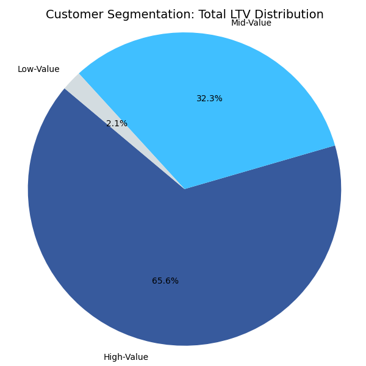
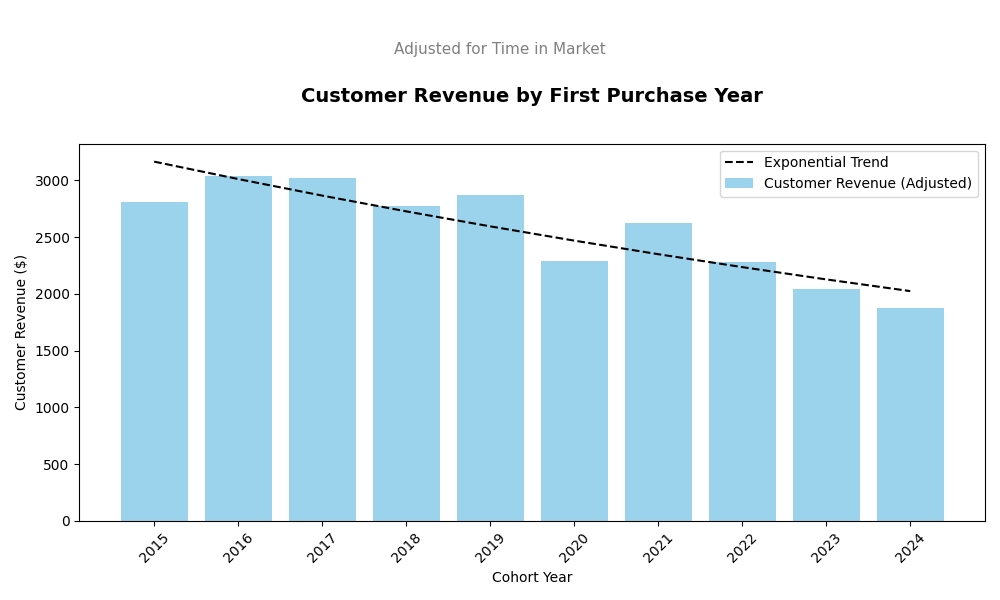
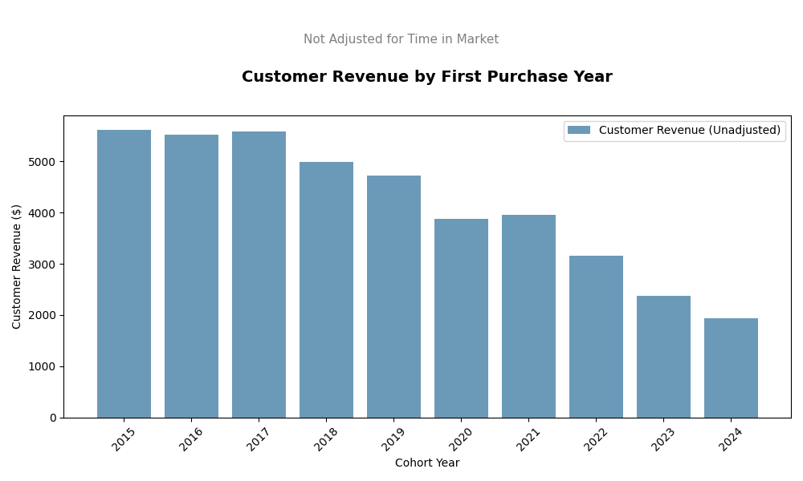
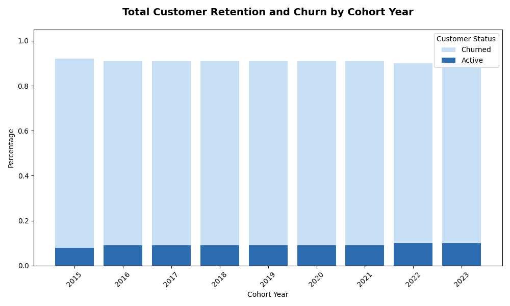

# SQL Project 3 - CONTOSO Sales Analysis

## What's it about? 
Analyzed customer behavior, loyalty, and value to boost retention and increase revenue for an e-commerce business.

## What was analyzed? 
1. **Customer Segmentation:** Identified the most valuable customer groups.
2. **Cohort Analysis:** Measured how different customer groups drive revenue over time.
3. **Retention Analysis:** Detected inactive customers to improve re-engagement.

## Clean Up Data

**Query**: [0_create_view.sql](0_create_view.sql)

- Combined sales and customer data to track revenue metrics.
- Identified first purchase dates for cohort insights.
- Built a unified view of transactions and customer profiles.

## Analysis

### 1. Customer Segmentation

**Query**: [1_customer_segmentation.sql](1_customer_segmentation.sql)

- Grouped customers by total lifetime value (LTV).
- Labeled segments as High, Mid, and Low value.
- Computed core metrics like total revenue.

**Visualization:**

**What was found?**
- Top 25% of customers generate 65.7% of revenue ($135.6M).
- Middle 50% contribute 32.2% ($66.4M).
- Bottom 25% bring in just 2% ($4.3M).

**What does it mean?**
The company should focus on retaining and nurturing high-value customers, upselling to mid-value ones, and minimizing resources spent on low-value segments unless they show potential for growth.

### 2. Customer Revenue by Cohort
**Query**: [2_cohort_analysis.sql](2_cohort_analysis.sql)

- Monitored revenue and customer count by cohort.
- Grouped cohorts by first purchase year.
- Evaluated revenue trends within each cohort.

**Visualization:**

Customer revenue by cohort, adjusted for time since first purchase.

Analyzed monthly revenue and customer trends using a 3-month rolling average.

  

**What was found?**  
- Customer spend appears to decline in recent cohorts: adjusted revenue dropped from ~$2,800+ (2016–2019) to ~$1,880 in 2024. However, unadjusted data shows this is largely due to less time in market, not necessarily lower LTV potential.
- Revenue peaked in 2022, but both customer count and adjusted revenue are down in 2024, signaling either weakened acquisition or reduced early value capture.
- Cohort volatility persists: sharp revenue shifts (e.g., 2020 dip, 2022 rebound, 2024 drop) suggest ongoing inconsistency in retention, onboarding, or targeting.

**What does it mean?**  
The drop in adjusted revenue and persistent volatility mean that management must stabilize early cohort performance through faster onboarding, retention design, and replicating strategies from high-performing years.

### 3. Customer Retention
Query: [3_retention_analysis.sql](3_retention_analysis.sql)

- Flagged customers likely to churn.
- Studied recent purchase behavior.
- Measured key metrics at the individual level.

**Visualization:**

**What was found?**  
- Churn consistently stabilizes at ~90% within 2–3 years across all cohorts, confirming a predictable but troubling retention pattern. 
- Retention remains critically low, with only ~8–10% of customers staying active long term — a clear sign of systemic engagement issues.
- Latest cohorts (2022–2023) are already showing identical churn curves, meaning the problem persists and will likely repeat unless retention strategies are overhauled.

**What does it mean?**  
Without fixing the first 2 years, you’re just watching 90% of your customers walk away. 

**----TLDR-----**

**Key Findings**  
- Revenue is heavily concentrated: Top 25% of customers generate over 65% of total revenue. Bottom 25% bring virtually none.
- Customer value is declining: Adjusted revenue in newer cohorts dropped by ~33% since 2019, though much of this is due to shorter lifetime exposure.
- Retention is broken: Across all cohorts, 90% of customers churn within 2–3 years. The retention curve hasn’t improved in nearly a decade.
- Acquisition is volatile: 2022 peaked in value, but 2024 is already lagging in both spend and volume.

**What Should Management Do?**  
- Double down on high-value customers: Prioritize retention, loyalty perks, and exclusive offers.
- Fix onboarding in the first 6 months: That’s where you either build LTV — or lose it forever.
- Preempt churn early: Use behavioral triggers (e.g. declining order frequency) to launch win-back campaigns.
- Replicate what worked in 2022: Analyze and reuse acquisition/retention strategies from peak years.
- Ignore low-value segments (for now): Don’t invest resources unless they show behavioral signals worth nurturing.
- Measure cohort health continuously: Track new customer behavior by week/month, not just annually.

## Technical Details
- **Database:** PostgreSQL
- **Analysis Tools:** PostgreSQL, DBeaver
- **Visualization:** Python
